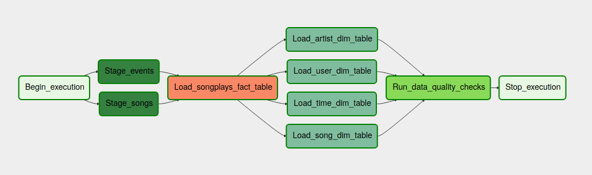

# Project 4: Data Pipelines with Airflow

## Problem discussion
A music streaming company, Sparkify, has decided that it is time to introduce more automation and monitoring to their data warehouse ETL pipelines and come to the conclusion that the best tool to achieve this is Apache Airflow.

In this project we will build an ETL pipeline with **Airflow** to move data from S3 to Redshift in a monthly schedule. The idea is to build data pipelines that are dynamic and built from reusable tasks, that can be monitored and allow easy backfills. The pipeline will also include a flexible Data Quality Operator to perform checks on the final tables.

## Solution
The solution will consist of a *dag* called sparkify.dag with the following graph structure:

As airflow requires a specific directory structure, it will be built as follows:

.
├── dags
│   └── udacity.py
│
├── plugins
│   ├── __init__.py
│   │
│   ├── helpers
│   │   ├── __init__.py
│   │   └── sql_queries.py
│   │
│   └── operators
│       ├── __init__.py
│       ├── data_quality.py
│       ├── load_dimension.py
│       ├── load_fact.py
│       └── stage_redshift.py
│
└── README.md

## Database schema
The analytic database will follow a **star** schema, with a facts table called songplays, that will store song reproductions, and four dimensions.

### Fact Table:
- **songplays**: songplay_id, start_time, user_id, level, song_id, artist_id, session_id, location, user_agent

### Dimension Tables
- **users**: user_id, first_name, last_name, gender, level
- **songs**: song_id, title, artist_id, year, duration
- **artists**: artist_id, name, location, latitude, longitude
- **time**: start_time, hour, day, week, month, year, weekday
